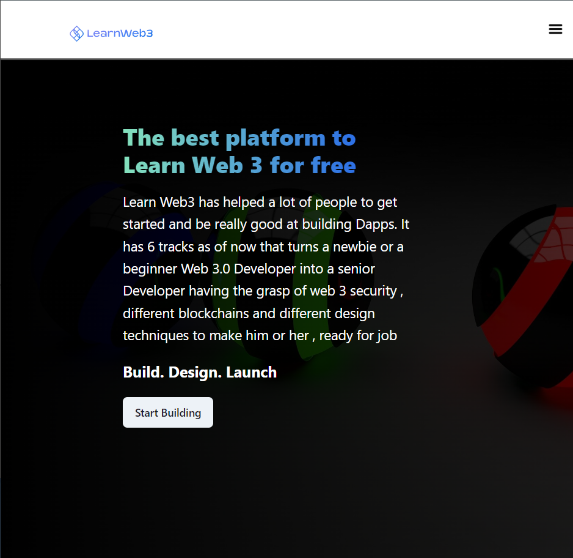

# LearnWeb3Dao Interview Task

This Project is designed to test my frontend, backend, and web3 skillsets.
I will be working with similar technologies on the job.
This is a feature that already exists on the LearnWeb3 platform 
They’re just interested in seeing how I would’ve designed this given the opportunity.

###

## Purpose
This project simply displays the NFTs owned by an address from LearnWeb3Dao and Buildspace Collections

## TechStack
  
    Next JS + Typescript   - Front end Development Framework
    Wagmi / Rainbow Wallet -  Connecting the Different Wallets
    Chakra UI              - For ReUsable React components
    Alchemy SDK            - Fetching Opensea Collections

## User Flow

    ✅ User opens your website
    ✅ User connects their Ethereum wallet
    ✅ Change Network to Polygon Mainnet
    ✅ Website loads all LearnWeb3 and Buildspace NFTs owned by that address
    ✅ Website displays all the images of those NFTs

#

#

#

## Deployment Link
https://lw3-task.vercel.app/

